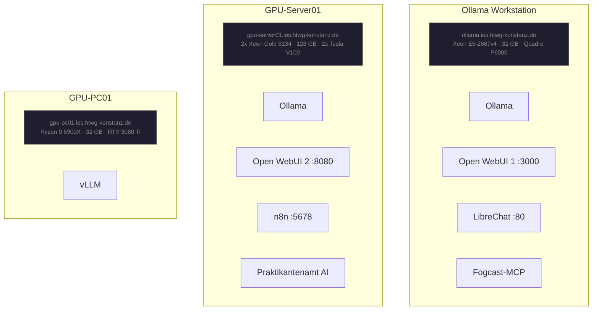

# Local-AI-Workflows

> Research & development of AI-powered workflows using local LLMs at **HTWG Konstanz** (IOS Lab).
> This organization contains the projects from the team project *"Untersuchung von LLM Workflows"* (WS 2024/25 – SS 2025).

---

## Repositories

### [Praktikantenamt-AI-Assistant](https://github.com/Local-AI-Workflows/Praktikantenamt-AI-Assistant)

An AI-powered email assistant for the university internship office (*Praktikantenamt*). It replaces manual email handling with a fully automated, LLM-driven pipeline:

- **Email Categorization** — Incoming messages are automatically routed to the right department (contracts, international affairs, scheduling)
- **Contract Validation** — Extracts student and company data from submitted internship contracts via OCR and validates against requirements (≥ 95 working days, German regional holiday rules)
- **Response Generation** — Proposes AI-drafted replies to common inquiries; a human reviews before sending
- **Administration** — Manages intern profiles and system configuration via MCP tools and centralized storage

Phase 1 (infrastructure setup) is complete. Phase 2 is ongoing: AI agents and MCP tools for categorization, contract extraction, and company lookup with fuzzy matching are implemented.

**Stack:** n8n · Ollama · Model Context Protocol (MCP) · Docker · SSE transport
**Runs on:** gpu-server01

---

### [Local-AI](https://github.com/Local-AI-Workflows/Local-AI)

The core research project (two semesters). It explores Model Context Protocol (MCP) integration with LLMs by building custom tool servers and an evaluation framework:

- **MCP Services** — Three custom tools: real-time weather data, timezone-aware time information, and campus Mensa meal info — built on Anthropic's MCP protocol
- **Evaluation Framework** — Tests multiple LLM providers (OpenAI, Anthropic Claude, local Ollama, LiteLLM) through a unified interface, measuring response quality, tool-use accuracy, and performance
- **Infrastructure** — Docker Compose manages the full service stack; Open WebUI provides a UI for local model inference

**Stack:** Python 3.8+ · FastAPI · Pydantic · Docker · Anthropic MCP SDK · LiteLLM

---

### [LLM-Benchmarking](https://github.com/Local-AI-Workflows/LLM-Benchmarking)

A comprehensive benchmarking toolkit for evaluating LLMs across multiple task types:

- **Standard Q&A** — Measures relevance, hallucinations, bias, fairness, and toxicity
- **RAG Benchmarks** — Context-aware evaluation for retrieval-augmented generation pipelines
- **Email Categorization** — Automated classification accuracy testing against labeled datasets
- **MCP Tool Usage** — Evaluates model tool-calling correctness and reliability

Results are stored in MongoDB and visualized in a Vue.js dashboard. The framework supports JSON, CSV, YAML, and plain text datasets and can be used via the dashboard UI, Python scripts, or REST API.

**Stack:** FastAPI · MongoDB · Vue.js · Ollama · Docker
**Requirements:** Python 3.10+ · Node.js 18+

---

### [Fogcast-MCP](https://github.com/Local-AI-Workflows/Fogcast-MCP)

A Model Context Protocol server exposing real-time weather data and forecasts for Konstanz, Germany. Designed for use with MCP-compatible LLM clients (e.g., Open WebUI, Claude Desktop).

Provides 7 tools: current conditions, weather summaries, forecast retrieval, available model listings, model-specific forecasts, multi-model comparison, and forecast summaries. Integrates DWD and OpenMeteo data sources. Datetime values are automatically rounded to the nearest hour as required by the Fogcast API.

**Stack:** Python 3.11 · Docker · DWD · OpenMeteo · MCP (async)
**Runs on:** Ollama Workstation (ollama.ios.htwg-konstanz.de)

---

### [HW-Benchmarking](https://github.com/Local-AI-Workflows/HW-Benchmarking)

Hardware benchmarking suite for the lab servers. Measures GPU/CPU throughput, memory bandwidth, and LLM inference performance across the different machines to inform decisions about where to schedule specific workloads.

**Stack:** Python · Docker *(in development)*

---

## Infrastructure Overview

All services run in Docker. Full hardware specs, SSH credentials, and service URLs are in the **[Infrastructure Doc on Nextcloud](https://nextcloud.in.htwg-konstanz.de/s/QoGGjQ8Sq6ytQ8q?dir=/&editing=false&openfile=true)** *(requires HTWG VPN)*.

---

## For the New Team

1. **Get VPN access** — All servers and the Nextcloud doc are only reachable from within the HTWG network or via VPN
2. **Read the [Infrastructure Doc](https://nextcloud.in.htwg-konstanz.de/s/QoGGjQ8Sq6ytQ8q?dir=/&editing=false&openfile=true)** — Contains SSH credentials and all service URLs
3. **Check each repo's README** — Every project has Docker-based setup instructions
4. **Keep the Nextcloud doc up to date** — It's the single source of truth for infra changes
